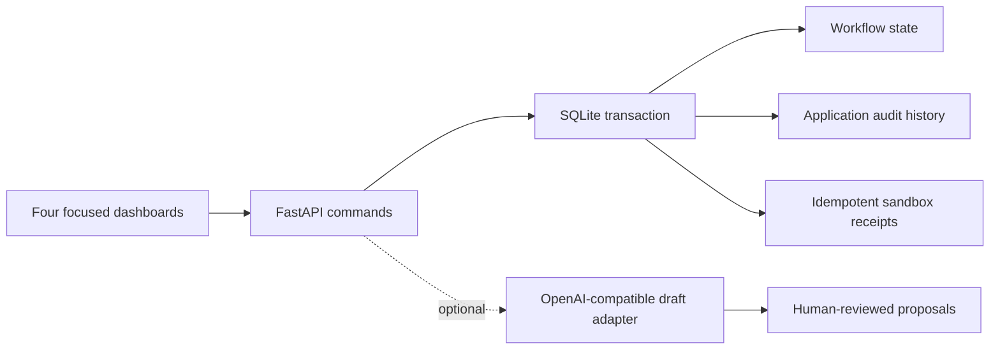

# Automation portfolio — four working business systems

Four independently demonstrable applications in one small FastAPI repository. Built as **self-initiated portfolio demonstrations**, with fictional organizations and synthetic data. No client work, revenue impact, production users or customer ROI is claimed.

**Public gallery:** https://metehanbergin.github.io/automation-portfolio/ — actual screenshots, readable case studies and captioned walkthroughs. The interactive backend applications run locally using the instructions below.

| Application | Buyer problem | Open locally |
|---|---|---|
| **LedgerFlow** | Remittance parsing, invoice matching and exception review | http://127.0.0.1:8765/remittance |
| **FieldFlow** | Lead qualification through quote, booking and follow-up | http://127.0.0.1:8765/leads |
| **StayOps** | Property-aware answers, policy escalation and reviewed knowledge | http://127.0.0.1:8765/guests |
| **TradeFlow** | Order-to-cash orchestration and supplier-failure recovery | http://127.0.0.1:8765/orders |

## Run locally

Requires Python 3.12+. The UI has no build step or Node dependency.

```powershell
python -m venv .venv
.\.venv\Scripts\python -m pip install -r requirements.txt
.\.venv\Scripts\python -m uvicorn app.main:app --host 127.0.0.1 --port 8765
```

On macOS/Linux replace `.\.venv\Scripts\python` with `.venv/bin/python`.

Open http://127.0.0.1:8765. The first request creates a private synthetic sandbox. SQLite persists business state across server restarts. Each browser receives a separate opaque HttpOnly session cookie. Sessions are eligible for cleanup after seven days of inactivity when a new session is created.

Use a new private browser window for a fresh demonstration. `POST /api/reset` resets only the current session's synthetic data. Do not enter real personal, financial or guest information.

## Validation

```powershell
.\.venv\Scripts\python -m pip install -r requirements-dev.txt
.\.venv\Scripts\python -X utf8 -m pytest -q
node --check web/app.js
```

The suite exercises real PDF/XLSX/CSV/EML parsers, accounting invariants, duplicate detection, partial payment approval, booking conflicts, outreach consent, property isolation, multilingual retrieval, protected policy routing, reviewed learning, stock reservation, retry exhaustion, role enforcement, reconciliation, session isolation, concurrent idempotency and transaction rollback. Optional LLM adapter tests use an HTTP mock transport; they are **contract tests, not live model verification**.

See [validation.md](validation.md) for the final verification record and limitations.

## Architecture



Domain modules are separate: `app/remittance.py`, `app/leads.py`, `app/guests.py`, `app/orders.py`. Shared transaction and receipt mechanics live in `app/core.py`. Each project folder contains its case study, architecture, demonstration script and actual application screenshots.

## Real versus simulated

**Runs here:** document parsing, structured extraction, deterministic decisions, TF-IDF-style scoped retrieval, approved multilingual answers, database updates, quote calculations, calendar conflict checks, lifecycle transitions, bounded retries, exception deadlines, human review, role checks and audit export.

**Simulated boundaries:** incoming mailbox transport, accounting/CRM services, calendar provider, email/SMS, guest messaging, supplier/warehouse/POD/carrier APIs, bank feeds and invoicing providers. `sandbox_delivered` means a local receipt was written. It does **not** mean a message was sent or a real system was updated.

**Default AI behavior:** constrained local extraction/rules and lexical retrieval. Language detection is heuristic for English, Spanish and Turkish. Answers are quoted from approved knowledge; there is no hidden live LLM call. `app/ai.py` supplies a tested OpenAI-compatible JSON draft adapter for extraction, qualification and knowledge proposals. It is disabled by default and never approves a payment, booking, policy exception or knowledge entry.

To enable a separately provisioned model endpoint, explicitly configure `PORTFOLIO_LLM_ENABLED=1`, `PORTFOLIO_LLM_BASE_URL` (ending in `/v1`), `PORTFOLIO_LLM_MODEL`, and optionally `PORTFOLIO_LLM_API_KEY`. Keep credentials outside the repository. Submit `action: "ai_draft"` with `data.source` to a project command endpoint. Drafts are stored for review; they do not mutate business records. Configuring a hosted model can incur that provider's charges. No model account or paid service was provisioned for this portfolio.

## API example

Interactive API documentation is at `/docs`; the dashboard initializes the session first. All commands use the current session cookie.

```json
{
  "action": "intake",
  "role": "operator",
  "data": {
    "key": "WEBSITE-001",
    "account": "AC-102",
    "sku": "CHAIR",
    "quantity": 4,
    "scenario": "supplier_failure"
  }
}
```

Send to `POST /api/orders/command`. Repeating the identical key/payload returns the same order. Changing the payload while reusing a key is rejected.

Duplicate checks compare against the immutable original input, so replay remains safe after a reviewer corrects the working customer record. Quantities and source prices in cents must be whole numbers; fractional input is rejected without creating an order.

## Deployment

The Dockerfile runs the same application as a non-root user. Mount a persistent volume at `/data` for SQLite.

```sh
docker build -t automation-portfolio .
docker run --rm -p 127.0.0.1:8765:8000 -v portfolio-data:/data automation-portfolio
```

The container recipe is supplied for deployment; see validation for whether a Docker build was available on the authoring machine. The static public portfolio uses actual screenshots and captioned walkthrough videos. It is not a hosted version of the backend applications.

## Production boundaries

This is intentionally a sandbox, not a multi-tenant finance or hospitality production product. Demo roles are selectable and illustrate server-enforced action authorization; they are not identity authentication. Audit events are append-only through application actions but are not tamper-evident. The outbox is a local receipt store, not a remote dispatcher. Demo clocks advance on demand rather than through a continuously running worker. A production implementation needs identity/tenant authorization, webhook authentication, provider acceptance tests, real background scheduling, retention/backup controls, monitoring and operational review. Retrieval and emergency keywords are deliberately bounded; unsupported phrasing should be assessed before production use.

## Repository map

- `app/` — domain engines, API and optional AI adapter
- `web/` — responsive application UI, no frontend build toolchain
- `tests/` — workflow and integration-contract tests
- `projects/` — four case studies, diagrams, sample data and assets
- `scripts/` — reproducible asset/data helpers
- `site/` — public portfolio gallery
- `.github/workflows/` — test and static-site publishing workflows
